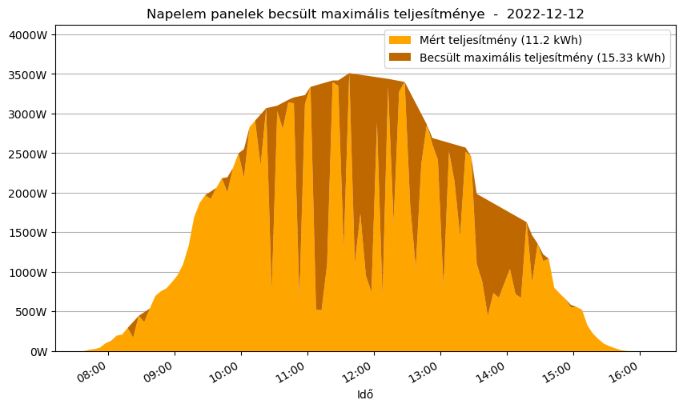
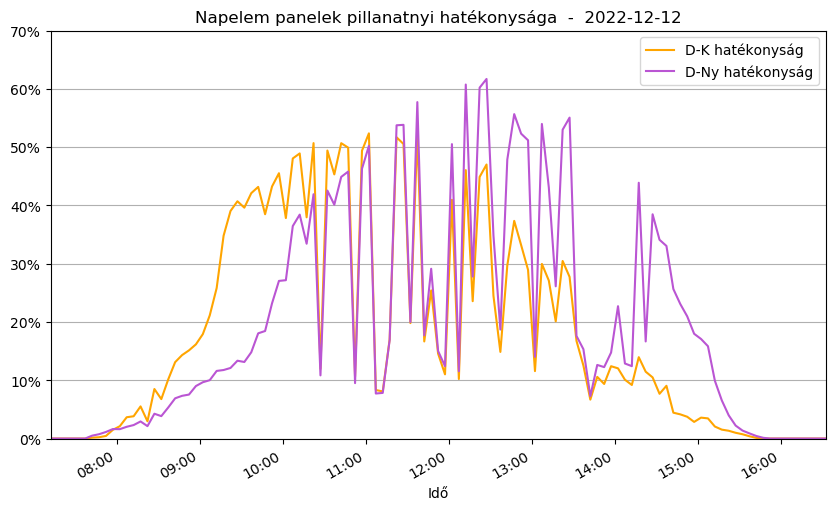
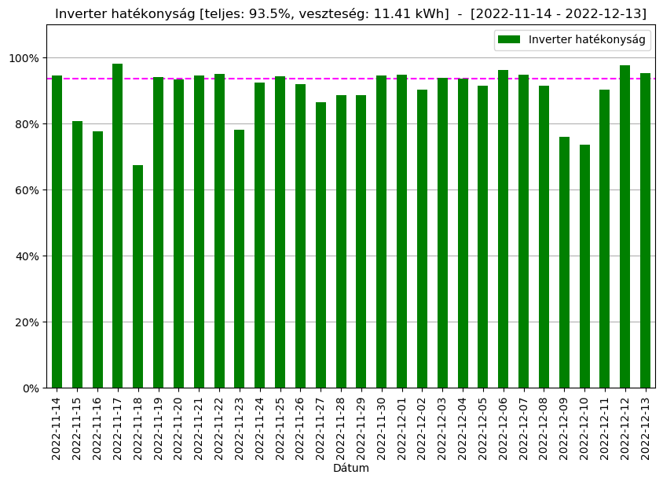
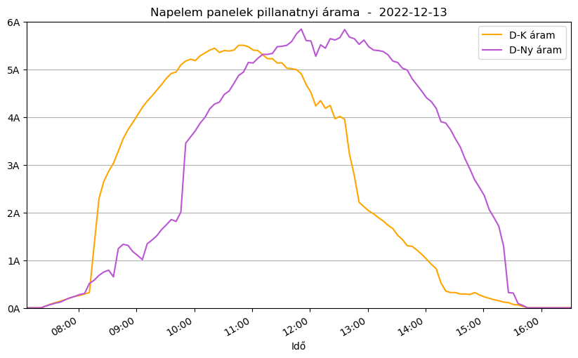
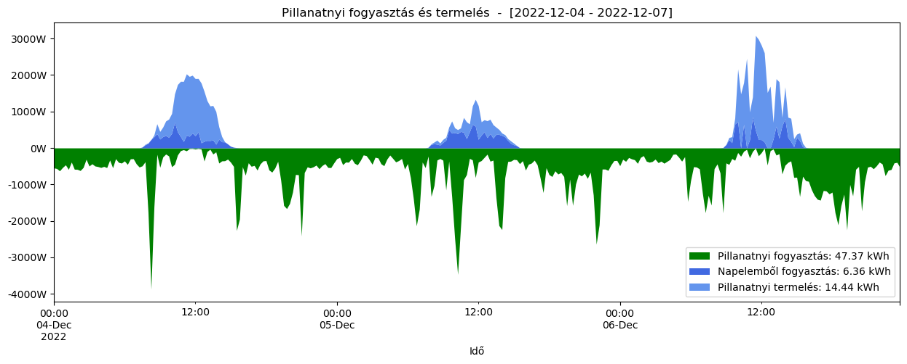
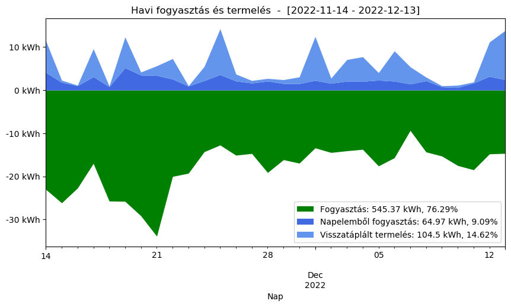

- [Napelem otthon: az első hónap eredménye](#napelem-otthon-az-első-hónap-eredménye)
    - [A rendszer](#a-rendszer)
    - [A program](#a-program)
  - [Az első havi termelés (november-december)](#az-első-havi-termelés-november-december)
  - [Mennyit termeltünk volna, ha a nap végig sütött volna](#mennyit-termeltünk-volna-ha-a-nap-végig-sütött-volna)
  - [A névleges teljesítmény hány százalékán mentek a panelek](#a-névleges-teljesítmény-hány-százalékán-mentek-a-panelek)
  - [Az inverter hatékonysága](#az-inverter-hatékonysága)
  - [Dél-Kelet és Dél-Nyugat](#dél-kelet-és-dél-nyugat)
  - [Télen elfogyasztjuk-e a megtermelt energiát](#télen-elfogyasztjuk-e-a-megtermelt-energiát)
  - [Havi energia egyenleg](#havi-energia-egyenleg)
  - [A szaldó problémája](#a-szaldó-problémája)
  - [Záró sorok](#záró-sorok)

# Napelem otthon: az első hónap eredménye

Valamivel több mint 10 hónap aktatologatás után november közepére elindult a napelemünk. Rögtön rá is vetettem magam, hogy minden rezdülését megfigyeljem, kielemezzem és megértsem. Ez a dokumentáció főleg technikai részleteket fog tartalmazni arról, hogy hogyan is viselkedik a házunk tetején a napelem.

### A rendszer

* jelenleg 16 napelem van a tetőn, 6 dél-nyugati, 10 dél-keleti irányba
* a napelemek Risen RSM40-8-405M-405W típusú monokristályos panelek, 405W csúcsteljesítménnyel
* az inverter Solplanet ASW10K-LT-G2 típusú

### A program

A program, amivel kielemzem az adatokat Linux alatt fut, bash-t és python pandas-t használ. Letölti az inverter adatait a www.aisweicloud.com címről, az EON adatait pedig a távleolvasási portálról. Az adatok letöltése után közös táblázatba varázsol mindent és elkészíti képeket.

## Az első havi termelés (november-december)

A novemberi termelés nem sikerült túl rózsásan, 164&nbsp;kWh körül alakult, ami elsőre igencsak kevésnek tűnik. Ebből nem fogjuk felfűteni a lakást, de szerencsére nem is akarjuk.

Amikor sütött a nap, akkor termeltünk is rendesen, de az elmúlt hónapban nem sokszor láttunk ilyet. A monokristályos napelemek problémája, hogy a szórt fényt alacsony hatékonyság mellett hasznosítják. Volt nap, amikor 13.9&nbsp;kWh-t termeltünk, máskor pedig csak 0.7&nbsp;kWh-t sikerült.

A dél-keleti és dél-nyugati oldal közel azonos hatékonysággal termelt, ami nagyon jó hír, nagy hiba nincs, mindkét lánc működik.

## Mennyit termeltünk volna, ha a nap végig sütött volna

Feltesszük a kérdést, hogy ha a nap végig sütött volna, mit kaptunk volna.

Az ábráról szépen leolvasható, hogy a decemberi nap 15&nbsp;kWh-t tudna termelni tiszta időben. Ha végig így sütött volna, akkor 450&nbsp;kWh körül alakult volna a termelés. A rossz idő a termelés majdnem 2/3-át elvitte.

 0&nbsp;kWh (végig havazás) és 450&nbsp;kWh (végig napsütés) között bármilyen értéket kaphattunk volna, időjárásfüggő.

Bár a nap dőlésszöge nem ideális, a napsütéses órák száma nagyon kevés, de ez az adat nem számít rossznak.

## A névleges teljesítmény hány százalékán mentek a panelek

A napelemek 405W-ot tudnak csúcson leadni, a kérdés, hogy mennyit adtak le valójában.

A decemberi napfényben volt, hogy Dél-Kelet 50%-ot is elért, Dél-Nyugat meg egészen 60%-ig elment. Téli adatnak jó. Nyáron simán elérheti ez a rendszer a napi 30-35&nbsp;kWh-t.

## Az inverter hatékonysága

Az inverter hatékonysága megmutatja, hogy a panelek által termelt energia hány százaléka jut el a hálózatba.

Az átlag 93.5%-os hatékonyság alacsonynak tűnik. Jól kivehető, hogy jó időben magas a hatékonyság, felhős és borult időben az amúgy is kevés energiát jobban pazaroljuk. Van különbség inverter és inverter között, a Solplanet ennyit tud. A keletkezett 11&nbsp;kWh veszteség havi szinten 770&nbsp;Ft-ot jelent új áron. Vannak jobb inverterek is dupla ennyi pénzért, bár a megtérülés kérdéses.

## Dél-Kelet és Dél-Nyugat

A Dél-Kelet, Dél-Nyugat telepítés némileg rosszabb, mintha Délre nézne mindegyik panel, de ez nem jelentős, 5%-os csökkenést jelent az egész évre. Előnye viszont az ilyen rendszernek, hogy egyenletesebben termel, mintha tisztán déli tájolású lenne a rendszer. A déli csúcstermelés alacsonyabb, viszont a reggeli, esti termelés magasabb. Télen a megtermelt energia lényegesen kevesebb a déli tájoláshoz képest, nyáron ez kevésbé érzékelhető.

A napelem láncok áramán szépen látszik, hogy Dél-Nyugat másfél órával később éri el a csúcsot, mint Dél-Kelet.

 * Dél-Nyugat télen jobb, mert a reggelek ködösek
 * Dél-Kelet nyáron jobb, mert hidegben a panelek hatékonysága magasabb

A telepítők Dél-Keletet választják, mert a nyári termelés fontosabb.

Érdemes észrevenni, hogy Dél-Nyugaton 10:00-kor kel a nap, Dél-Keleten 13:00-kor nyugszik le. Télen ez okozza a kiesés zömét, nagyon rövid a megvilágított időszak.

## Télen elfogyasztjuk-e a megtermelt energiát

Nemrég tiltásra került a visszatáplálás napelemes rendszerek esetén. Nyáron természetesen a legtöbb napelemes rendszer visszatáplál, de a kérdés, hogy télen is ezt csinálja-e.

Annak ellenére, hogy jelenleg egy szobát villanyradiátorral fűtünk, jól látható, hogy a napelem a termelt energia zömét visszatáplálja. Még télen is jelentős az el nem fogyasztott energia. A 3000W termelés igencsak sok, sosem lesz ennyi elfogyasztva.

Az akkumulátoros rendszerek megkövetelése érthető, bár a megtérülés ebben az esetben kérdéses, a környezetvédelmi problémákról nem is beszélve. Vannak országok, ahol sosem volt megengedve a visszatáplálás, de az akkumulátoros rendszerek mégis jól működnek.

Ugyanakkor egy államilag jóváhagyott beruházás esetén a visszamenőleges módosítás megtérülési idő előtt mindenképpen aláássa a jogállamba vetett bizalmat.

## Havi energia egyenleg

Minthogy klímával fűtöttünk a novemberi hónapban, a napelem képtelen volt ezt kompenzálni, ezért a fogyasztás magasabb volt a megszokottnál. Ennek ellenére is látható, hogy a megtermelt energia 2/3-át visszatápláltuk.

## A szaldó problémája

A szaldó elszámolás bevezetése hiba volt, mert a napelem telepítőket déli csúcstermelésre ösztönözte. Egyenletes termeléshez Kelet-Nyugat rendszer szükséges, polikristályos napelemmel, kicsit túlméretezve, hibrid inverterrel és akkumulátorral.

Hiába változtatna a kormány utólag a villamosáram átvételi díján, senki sem fogja újraépíteni a meglévő rendszerét. Idáig mindent pont fordítva építettünk, csúcstermelésre optimalizáltunk nem egyenletes energiaszolgáltatásra.

Az áramdíjakkal és a visszatáplálás esetleges tiltásával nem lehet utólag javítani a problémát, csak soha meg nem térülővé tenni a jelenlegi beruházásokat.

A túltermelés ugyanakkor nem tud kárt okozni a rendszerben, mert az inverterek automatikusan leállnak, ha túl sok energia  lenne a hálózaton.

Ráadásul léteznek még fokozatok a "mindenkit engedünk visszatáplálni" és "senkit sem engedünk visszatáplálni" között. Vannak külföldi szolgáltatók, melyek fixen előírják, hogy mennyit engednek visszatermelni, a többlettel a tulajdonos meg azt tesz, amit akar.

## Záró sorok

A rendszer elindult és megfelelően termel is. A Solplanet inverter többé-kevésbé hatékony, itt-ott hibázik, viszont versenyképes ára van.

A téli normál fogyasztást (fűtés nélkül) nem tudja biztosítani a rendszer a napi 5.5&nbsp;kWh átlagtermeléssel. Legalább dupla ennyi panel kellene ahhoz, hogy önellátóak legyünk. Ebben az esetben viszont nyáron jelentős túltermelés keletkezne, a megtermelt energia zöme pedig a paneleket melegítené a háztetőn érdemleges áramtermelés helyett.
